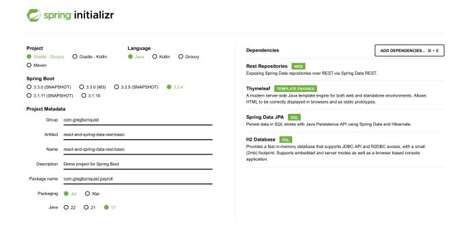
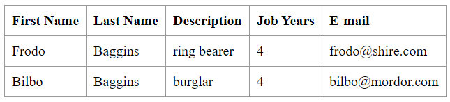

# Class Assignment 2, Part 2 : Build Tools with Gradle

## Introduction

In the second part of this assignment, the goal was to use the DevOps repository and use a basic Gradle application to introduce some new and simple features,
which would help to understand how the gradle wrapper works and how to edit the build.gradle file to add new tasks and dependencies. For each new task or feature
added, issues were created in the DevOps repository, which were then associated with the commits made to implement said feature.

## Setting up the project

1. The first step required to start this part of the assignment was to create a new branch named *tut-basic-gradle* in the DevOps repository.
```bash
git branch tut-basic-gradle
```

2. After creating the branch, it was necessary to switch to it.
```bash
git checkout tut-basic-gradle
```

3. To generate a new Gradle Spring Boot project, it was necessary to access the following [website](https://start.spring.io/), and fill in the necessary information
   and add all the required dependencies, as illustrated by the picture below.



4. After generating the project, it was necessary to extract the zip file inside the CA2/Part2 directory.

5. The next step was to delete the *src* directory as it was not necessary for this assignment.

6. Copy the *CA1/basic/src* directory to the root of the project, as well as the *CA1/basic/webpack.config.js* and *CA1/basic/package.json* files.

7. Delete the *CA2/Part2/src/main/resources/static/built* directory.

8. It was necessary to update the all imports regarding persistence in *CA2/Part2/src/main/java/com/greglturnquist/payroll/Employee.java* from *javax.persistence* to *jakarta.persistence*.

9. After completing the previous steps, the project was built to check if everything was working correctly.
```bash
./gradlew build
```

10. To verify if the application was working correctly, it was necessary to run the following command:
```bash
./gradlew bootRun
```
This command would start the Spring Boot application, and it was possible to access it through the following [URL](http://localhost:8080/).
At this point, the result webpage should be empty, as the frontend plugin was not added yet to the project.

11. After completing the previous steps, all the changes were committed to the remote repository.

```bash
git add .
git commit -m "close #15 - added basic folder to CA2/Part2"
git push origin tut-basic-gradle
```

## Implementing the new features

### Part 1: Addition of the frontend plugin

For this part of the assignment, the goal was to add the frontend plugin to the project, which would allow the project to build the frontend code using npm and webpack.

1. The first step was to add the frontend plugin to the *build.gradle* file.
```groovy
 id "org.siouan.frontend-jdk17" version "8.0.0"
```

2. To configure the frontend plugin, it was necessary to add the following code to the *build.gradle* file.
```groovy
 frontend {
 nodeVersion = "16.20.2"
 assembleScript = "run build"
 cleanScript = "run clean"
 checkScript = "run check"
 }
```

3. To configure the execution of the webpack, it was necessary to update the script section of the *package.json* file.
```json
"scripts": {
    "watch": "webpack --watch -d --output ./target/classes/static/built/bundle.js",
    "webpack": "webpack",
    "build": "npm run webpack",
    "check": "echo Checking frontend",
    "clean": "echo Cleaning frontend",
    "lint": "echo Linting frontend",
    "test": "echo Testing frontend"
  },
```

4. Also in the *package.json* file, it was required to add the package manager, before the script section.
```json
"packageManager": "npm@9.6.7",
```

5. After completing the previous steps, it was necessary to build the project to check if everything was working correctly.
```bash
./gradlew build
```

6. To verify if the application was working correctly, it was necessary to run the following command:
```bash
./gradlew bootRun
```
After the addition and configuration of the frontend plugin, the result webpage should display a result similar to the one in the picture below:


7. After all the changes were successfully implemented, the project was committed to the remote repository.
```bash
git add .
git commit -m "close #16 - added frontend plugin"
git push origin tut-basic-gradle
```

### Part 2: Addition of the copyJarFiles task

The goal for this part of the assignment was to create a task to copy the generated jar files to a new directory named *dist*.

1. The first step was to add the following code to the *build.gradle* file.
```groovy
task copyJarFiles(dependsOn: build) {
    doLast {
        copy {
            from 'build/libs/'
            into 'dist'
            include '*.jar'
        }
    }
}
```

2. After adding the task, it was necessary to run it to check if it was working correctly.
```bash
/.gradlew copyJarFiles
```

3. After completing the previous steps, the project was committed to the remote repository.
```bash
git add .
git commit -m "close #17 - added task to copy jar files from build/libs to dist"
git push origin tut-basic-gradle
```

### Part 3: Addition of the deleteWebpackFiles task

The purpose of the final part of this assignment was to create a task to delete the generated webpack files, which are automatically
generated when the webpack is executed.

1. The first step was to add the following code to the *build.gradle* file.
```groovy
task deleteWebpackFiles(dependsOn: clean) {
	doLast {
		delete 'src/main/resources/static/built'
	}
}
```

2. After adding the task, it was necessary to run it to check if it was working correctly.
```bash
/.gradlew deleteWebpackFiles
```

3. After completing the previous steps, the project was committed to the remote repository.
```bash
git add .
git commit -m "close #18 - added task to delete the files generated by webpack"
git push origin tut-basic-gradle
```

### Merging the branch
As this final part of the assignment was completed, the branch was merged into the main branch of the DevOps repository.
```bash
git checkout main
git merge --no-ff tut-basic-gradle
git push
```

## Implementing an alternative solution: Maven

A possible alternative solution to this assignment could be the use of a different build automation tool, in this case, Maven was the build tool chosen.
Maven is a build automation tool used mainly for Java projects, where the project structure as well as dependencies and plugins are defined in a XML file.
In order to achieve the same goals that were achieved using Gradle, a Maven Spring Boot project was generated in the following [website](https://start.spring.io/).
The only difference between this alternative and the Gradle implementation would be the build tool chosen. All the other aspects, including dependencies (Rest Repository,
Thymeleaf, Spring Data JPA, H2 Database) were the same, and the generated project included the chosen dependencies in its pom.xml file.

To complete the rest of the assignment using Maven, the src directory was deleted and replaced with *CA1/basic/src* directory. *CA1/basic/webpack.config.js* and *CA1/basic/package.json*
were also added to the project's root, and the *CA2/Part2-Maven/src/main/resources/static/built* was deleted.

After finishing all these steps, the frontend plugin, the equivalent to the copyJarFiles task and the deleteWebpacksFiles task were added to the pom.xml file of this project.

 1. Addition of the frontend plugin:
```xml
<plugin>
				<groupId>com.github.eirslett</groupId>
				<artifactId>frontend-maven-plugin</artifactId>
				<version>1.9.1</version>
				<configuration>
					<installDirectory>target</installDirectory>
				</configuration>
				<executions>
					<execution>
						<id>install node and npm</id>
						<goals>
							<goal>install-node-and-npm</goal>
						</goals>
						<configuration>
							<nodeVersion>v12.14.0</nodeVersion>
							<npmVersion>6.13.4</npmVersion>
						</configuration>
					</execution>
					<execution>
						<id>npm install</id>
						<goals>
							<goal>npm</goal>
						</goals>
						<configuration>
							<arguments>install</arguments>
						</configuration>
					</execution>
					<execution>
						<id>webpack build</id>
						<goals>
							<goal>webpack</goal>
						</goals>
					</execution>
				</executions>
			</plugin>
```

 2. Addition of the copyJar plugin to copy the project .jar files and add them to a dist directory:
```xml
<plugin>
				<groupId>org.apache.maven.plugins</groupId>
				<artifactId>maven-resources-plugin</artifactId>
				<version>3.2.0</version>
				<executions>
					<execution>
						<id>copy-jar</id>
						<phase>package</phase>
						<goals>
							<goal>copy-resources</goal>
						</goals>
						<configuration>
							<outputDirectory>${project.basedir}/dist</outputDirectory>
							<resources>
								<resource>
									<directory>${project.build.directory}</directory>
									<includes>
										<include>*.jar</include>
									</includes>
								</resource>
							</resources>
						</configuration>
					</execution>
				</executions>
			</plugin>
```

 3. Addition of a clean plugin to delete the webpack files generated:
```xml
<plugin>
				<artifactId>maven-clean-plugin</artifactId>
				<version>3.1.0</version>
				<configuration>
					<filesets>
						<fileset>
							<directory>${project.basedir}/src/main/resources/static/built</directory>
							<includes>
								<include>**/*</include>
							</includes>
						</fileset>
					</filesets>
				</configuration>
			</plugin>
 ```

After adding all the desired plugins to the pom.xml file, the project was built to check if everything was working correctly.
```bash
mvn compile
```

To verify if the application was generating the frontend files correctly, the following command was used:
```bash
mvn spring-boot:run
```

To run the clean plugin independently and clean the webpack files, the following command was used:
```bash
mvn clean
```

These commands could also be applied using Maven wrapper, which would be the equivalent to the Gradle wrapper.

In conclusion, both Gradle and Maven are powerful build automation tools used primarily for Java projects. They both offer a wide range of features
and capabilities that can cater to different project requirements. Maven, with its convention-over-configuration approach, provides a standardized
and straightforward way of building projects. It uses an XML-based configuration file and has a well-defined lifecycle, making it easier for new
developers to understand and use.  On the other hand, Gradle offers more flexibility and control over the build process. It uses a Groovy-based DSL
for its configuration files, which can be more expressive and easier to read than XML. Gradle also offers performance advantages, such as incremental
builds and build caching, which can significantly speed up build times.  Choosing between Gradle and Maven often comes down to the specific needs of the
project and the preferences of the development team. Both tools have strong community support and extensive plugin ecosystems, making them suitable for a
wide range of projects.


