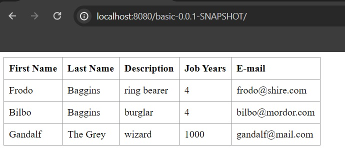

# Class Assignment 4 - Part 2 : Containers with Docker

## Introduction
The goal for the second part of this class assignment was to use Docker to create two images, one to run a web application and another to host an H2 database.
A docker-compose file was created to run a container with both images and connect them, so the web application could access the database.
For this assignment, the contents of the application from Class Assigment 2 - Part 2 were added to same directory as the Dockerfile and docker-compose.yml files.


## Building the Docker Image for the Web Application

This was the first Dockerfile created, which is responsible for building the Docker image for the web application:

```Dockerfile
FROM gradle:jdk21

WORKDIR /app

COPY . /app

RUN gradle clean build

 ENTRYPOINT ["gradle"]
 CMD ["bootRun"]
```

 - The Dockerfile starts by using the gradle:jdk21 image as the base image, which is an image that has Gradle and JDK 21 pre-installed.
 - The working directory inside the Docker image is set to /app, which means all subsequent commands will be executed from this directory.
 - The COPY command copies all the files from the current directory, where the Dockerfile-web is included, to the working directory inside the Docker image.
 - The RUN command executes ```./gradlew clean build``` command in the Docker container, which builds the web application.
 - The ENTRYPOINT command specifies the command that will be executed when the container is started from the Docker image.
 - The CMD command specifies the arguments that will be passed to the ENTRYPOINT command when the container is started. In this case, the arguments are ```bootRun```, 
which will start the Spring Boot application.


## Building the Docker Image for the H2 Database

Firstly, in order to establish a connection between the web application and the H2 database, the application.properties file was updated to use the H2 database:

```properties
server.servlet.context-path=/basic-0.0.1-SNAPSHOT
spring.data.rest.base-path=/api
#spring.datasource.url=jdbc:h2:mem:jpadb
spring.datasource.url=jdbc:h2:tcp://db:9092/./jpadb;DB_CLOSE_DELAY=-1;DB_CLOSE_ON_EXIT=FALSE
spring.datasource.driverClassName=org.h2.Driver
spring.datasource.username=sa
spring.datasource.password=
spring.jpa.database-platform=org.hibernate.dialect.H2Dialect
#So that spring will not drop de database on every execution.
spring.jpa.hibernate.ddl-auto=update
spring.h2.console.enabled=true
spring.h2.console.path=/h2-console
spring.h2.console.settings.web-allow-others=true
```
The App.js file was also updated to include the following code:

```javascript
	componentDidMount() { // <2>
    client({method: 'GET', path: '/basic-0.0.1-SNAPSHOT/api/employees'}).done(response => {
        this.setState({employees: response.entity._embedded.employees});
    });
}
```

Finally, the second Dockerfile was created, which is responsible for building the Docker image for the H2 database:

```Dockerfile
FROM gradle:jdk21

WORKDIR opt/h2

# Download H2 Database and run it
RUN wget https://repo1.maven.org/maven2/com/h2database/h2/1.4.200/h2-1.4.200.jar -O h2.jar

EXPOSE 8082
EXPOSE 9092

# Start H2 Server
CMD ["java", "-cp", "h2.jar", "org.h2.tools.Server", "-ifNotExists", "-web", "-webAllowOthers", "-webPort", "8082", "-tcp", "-tcpAllowOthers", "-tcpPort", "9092"]
```

 - The Dockerfile starts by using the gradle:jdk21 image as the base image, which is an image that already has Gradle and JDK 21 pre-installed.
 - The WORKDIR command sets the working directory inside the Docker image to /opt/h2, which means all subsequent commands will be executed from this directory.
 - The RUN command downloads the H2 database JAR file from the Maven repository and saves it as h2.jar in the working directory.
 - The EXPOSE command exposes the ports 8082 and 9092, which are the ports that the H2 database will be running on.
 - Finally, the CMD command specifies the command that will be executed when the container is started from the Docker image. In this case, the command starts the H2 database server with the following options:
    - -ifNotExists: creates the database if it does not exist.
    - -web: starts the H2 web console.
    - -webAllowOthers: allows other computers to connect to the H2 web console.
    - -webPort 8082: specifies the port that the H2 web console will be running on.
    - -tcp: starts the H2 TCP server.
    - -tcpAllowOthers: allows other computers to connect to the H2 TCP server.
    - -tcpPort 9092: specifies the port that the H2 TCP server will be running on.

## Creating the docker-compose file

Finally, the docker-compose.yml file was created to run a container with both images and connect them, so the web application could access the database:

```yaml
services:
  db:
    build:
      context: .
      dockerfile: Dockerfile-db
    container_name: CA4-Part2-db
    ports:
      - "8082:8082"
      - "9092:9092"
    volumes:
      - h2-data:/opt/h2-data

  web:
    build:
      context: .
      dockerfile: Dockerfile-web
    container_name: CA4-Part2-web
    ports:
      - "8080:8080"
    depends_on:
      - db

volumes:
  h2-data:
    driver: local
```

This docker-compose file defines two services, db and web, which correspond to the H2 database and the web application, respectively.
The db service uses the Dockerfile-db file to build the Docker image for the H2 database, while the web service uses the Dockerfile-web file to build the Docker image for the web application.
The db service exposes the ports 8082 and 9092, which are the ports that the H2 database will be running on, and creates a volume called h2-data to persist the data.
The web service exposes the port 8080, which is the port that the web application will be running on, and depends on the db service to ensure that the H2 database is running before the web application starts.
Finally, the volumes section defines the h2-data volume as a local volume to persist the data of the H2 database.

## Running the Docker Containers
In order to run the images created by both Dockerfiles in the same container, the following command was executed in the terminal:

```bash
docker-compose up --build
```
This command builds the Docker images for the web application and the H2 database, creates a container with both images, and starts the container.
The --build flag is used to ensure that the images are rebuilt before starting the container.
After running this command, the web application should be accessible at http://localhost:8080/basic-0.0.1-SNAPSHOT and the H2 database should be accessible at http://localhost:8082 or http://localhost:9092.
For the H2 console, the JDBC URL should be jdbc:h2:tcp://db:9092/./jpadb.
For this assignment, the H2 database was tested by adding employees and the web application was tested by retrieving the newly added employees from the database, as demonstrated in the screenshots below:





## Conclusion
In this class assignment, Docker was used to create two images, one for the web application and another for the H2 database, and a docker-compose file was created to run a container with both images and connect them.
This assignment demonstrated how Docker can be used to containerize applications and services, making it easier to deploy and manage them in different environments.
