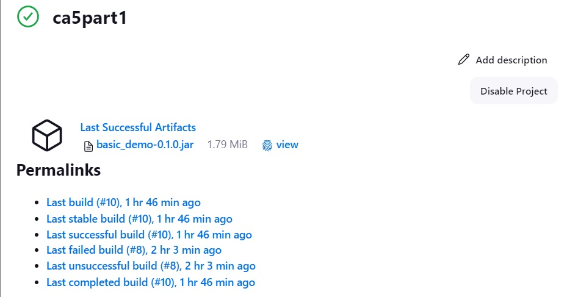
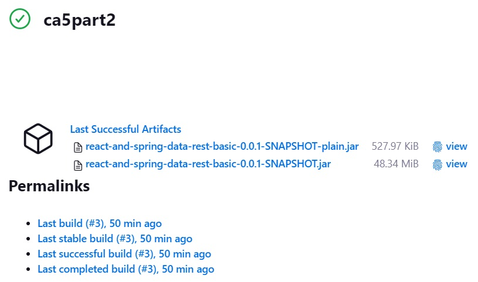
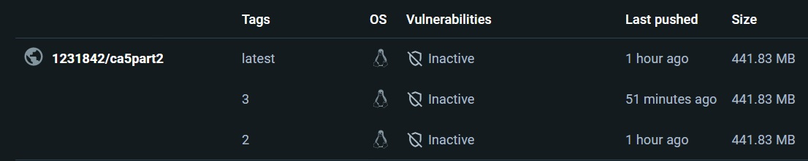
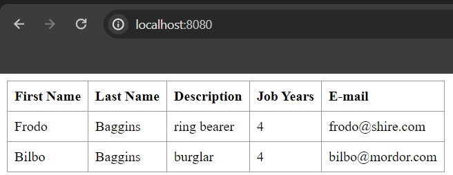

# Class Assigment 5 - CI/CD Pipelines with Jenkins

## Introduction
This assignment is about setting up a CI/CD pipeline using Jenkins. For this assignment, it's intended to create two pipelines with different
purposes. The first pipeline will be responsible for checking out, assembling, testing and creating an archive artifact of a Java project. 
The second pipeline will be responsible for checking out, assembling, testing, creating an archive artifact, generating JavaDoc and generating
a Docker image of a Java project.

## Requirements

### Installing Jenkins
In order to install Jenkins, the user can follow the instructions in the [official Jenkins website](https://www.jenkins.io/download/). For this assignment,
it was installed the msi version of Jenkins on a Windows machine, with the 2.452.2 LTS version. When installing Jenkins, all the default settings were applied, and
the port to access the Jenkins dashboard was set to 8094.

### Setting up Jenkins
After installing Jenkins, and in order to complete the second part of this assignment, it's required to install some plugins. The plugins that were installed were regarded
to Docker and HTML Publisher. The chosen plugins were Docker API, Docker Commons, Docker Pipeline and Docker, as well as HTML Publisher.
It was also required to create credentials for the Docker Hub account, in order to push the Docker image to the Docker Hub.

### Creating a pipeline
As it was intended to create a pipeline based on a Jenkinsfile from a repository, it was required to create a new item in Jenkins, choosing the option "Pipeline". After that, it was required to select
the option "Pipeline script from SCM", and to set the SCM to Git, with the repository URL and the branch name, as well as the path to the Jenkinsfile.

## First pipeline
The first pipeline is responsible for checking out, assembling, testing and creating an archive artifact of a Java project. The pipeline is divided into several stages
responsible for different tasks. The developed stages are the following:
- Checkout: This stage is responsible for checking out the project from the GitHub repository.
- Set Permissions: In this stage, executable permissions are set on the Gradle wrapper, using the Gradle command ```./gradlew```.
- Assemble: In this stage, the project is assembled using the Gradle command ```./gradlew assemble```.
- Test: This stage is responsible for testing the project, using the Gradle command ```./gradlew test```.
- Archive: In this stage, an archive artifact of the project is created and archived in the Jenkins workspace.

The pipeline script is the following:
```groovy
pipeline {
     agent any

     stages {
         stage('Checkout') {
             steps {
                 echo 'Checking out...'
                 git branch: 'main', url: 'https://github.com/maria-neto/devops-23-24-JPE-1231842.git'
             }
         }
         stage('Set Permissions') {
             steps {
                 dir('CA2/part1') {
                     echo 'Setting executable permissions on gradlew...'
                     bat 'gradlew.bat'
                 }
             }
         }
         stage('Assemble') {
             steps {
                 dir('CA2/Part1') {
                     echo 'Assembling the application...'
                     bat './gradlew.bat assemble'
                 }
             }
         }
         stage('Test') {
             steps {
                 dir('CA2/Part1') {
                     echo 'Running unit tests...'
                     bat './gradlew.bat test'
                 }
             }
         }
         stage('Archive') {
             steps {
             echo 'Archiving...'
             dir('CA2/Part1') {
                 archiveArtifacts 'build/libs/*.jar'
                 }
             }
         }
     }
 }
```

As this pipeline is intended to be executed in a Windows machine, the Gradle command ```./gradlew assemble``` was replaced by ```./gradlew.bat assemble``` in the script.
The pipeline was successfully executed, and the archive artifact was created and archived in the Jenkins workspace, as demonstrated in the picture below:



## Second pipeline
The second pipeline is responsible for checking out, assembling, testing, creating an archive artifact, generating JavaDoc and generating a Docker image of a Java project. 
The pipeline is divided into several stages, but first, it was required to set the environment variables for the Docker credentials ID, the Docker image and the Docker tag. The
developed stages are the following:
- Checkout: This stage is responsible for checking out the project from the GitHub repository.
- Set Permissions: In this stage, executable permissions are set on the Gradle wrapper, using the Gradle command ```./gradlew```.
- Assemble: In this stage, the project is assembled using the Gradle command ```./gradlew assemble```.
- Test: This stage is responsible for testing the project, using the Gradle command ```./gradlew test```.
- Archive: In this stage, an archive artifact of the project is created and archived in the Jenkins workspace.
- JavaDoc: This stage is responsible for generating the JavaDoc of the project.
- Create Dockerfile: At this stage a Dockerfile is created, which will be used to generate the Docker image of the project.
- Publish Image: This stage is responsible for pushing the generated image to the Docker Hub.

The pipeline script is the following:
```groovy
pipeline {
    agent any

    environment {
        DOCKER_CREDENTIALS_ID = 'credentials-id'
        DOCKER_IMAGE = '1231842/ca5part2'
        DOCKER_TAG = "${env.BUILD_ID}"
    }

    stages {
        stage('Checkout') {
            steps {
                echo 'Checking out the code...'
                git branch: 'main', url: 'https://github.com/maria-neto/devops-23-24-JPE-1231842.git'
            }
        }

        stage('Set Permissions') {
            steps {
                dir('CA2/part2') {
                    echo 'Setting executable permissions on gradlew...'
                    bat 'gradlew.bat'
                }
            }
        }

        stage('Assemble') {
            steps {
                dir('CA2/Part2') {
                    echo 'Assembling the application...'
                    bat './gradlew.bat assemble'
                }
            }
        }

        stage('Test') {
            steps {
                dir('CA2/Part2') {
                    echo 'Running unit tests...'
                    bat './gradlew.bat test'
                }
            }
        }

        stage('Javadoc') {
            steps {
                dir('CA2/Part2') {
                    echo 'Generating Javadoc...'
                    bat './gradlew.bat javadoc'
                    publishHTML(target: [
                        allowMissing: false,
                        alwaysLinkToLastBuild: false,
                        keepAll: true,
                        reportDir: 'build/docs/javadoc',
                        reportFiles: 'index.html',
                        reportName: 'Javadoc'
                    ])
                }
            }
        }

        stage('Archive') {
            steps {
                dir('CA2/Part2') {
                    echo 'Archiving artifacts...'
                    archiveArtifacts artifacts: 'build/libs/*.jar', fingerprint: true
                }
            }
        }

        stage('Create Dockerfile') {
            steps {
                dir('CA2/Part2') {
                    script {
                        def dockerfileContent = """
                        FROM gradle:jdk21
                        WORKDIR /app
                        COPY build/libs/*.jar app.jar
                        EXPOSE 8080
                        ENTRYPOINT ["java", "-jar", "app.jar"]
                        """
                        writeFile file: 'Dockerfile', text: dockerfileContent
                    }
                }
            }
        }

        stage('Publish Image') {
            steps {
                script {
                    echo 'Building and publishing Docker image...'
                    docker.withRegistry('https://index.docker.io/v1/', "${DOCKER_CREDENTIALS_ID}") {
                        dir('CA2/Part2') {
                            def customImage = docker.build("${DOCKER_IMAGE}:${DOCKER_TAG}")
                            customImage.push()
                        }
                    }
                }
            }
        }
    }
}
```
As it happened with the first pipeline, the Gradle command ```./gradlew assemble``` was replaced by ```./gradlew.bat assemble``` in the script, as this pipeline is intended to be executed in a Windows machine.
The pipeline was successfully executed, the archive artifact was generated and the Docker image was published in the Docker Hub, as demonstrated in the following images:





In order to run the Docker image, it was required to pull the image from the Docker Hub, using the command ```docker pull 1231842/ca5part2:3```, and to run the image, using the 
command ```docker run -p 8080:8080 1231842/ca5part2:3```. After running the image, it was possible to access the application in the browser, using the URL http://localhost:8080.



## Conclusion
The main goal of this assignment was to understand how to set up a CI/CD pipeline using Jenkins. The development of Jenkins pipelines allows the automation of several stages of the software development process, such
as checking out, assembling, testing, creating archive artifacts, generating JavaDoc and generating and publishing Docker images. In the process of developing the pipelines, some difficulties were faced, such as the 
need to adapt and modify the scripts in both Jenkinsfiles, in order to make them compatible with the Windows machine. However, after solving these issues, the pipelines were successfully executed.
Overall, the successful implementation of the CI/CD pipelines using Jenkins has significantly optimized the software development process, reinforcing the importance of automation in modern software development.


